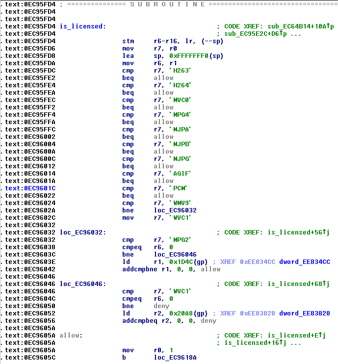

# raspi-keygen

This is an effort to reverse-engineer the Raspberry Pi license key check for
MPEG-2 and VC-1 hardware video encoding.

## Patch

A patch for `start.elf`, a firmwware blob for the VideoCore IV processor used by
all Raspberry Pi models, was posted to 
[reddit](https://www.reddit.com/r/raspberry_pi/comments/5x7xbo/patch_for_mpeg2_vc1_license/)
by [/u/fuck_the_mpeg_la](https://www.reddit.com/user/fuck_the_mpeg_la)
on 03-03-2017:

```bash
cd /boot
cp start.elf start.elf_backup && \
 perl -pne 's/\x47\xE9362H\x3C\x18/\x47\xE9362H\x3C\x1F/g' < start.elf_backup > start.elf
```

Applying it to a
[4.14.44 `start.elf`](https://github.com/raspberrypi/firmware/blob/a154f2136850dba827cf4bc40794854376902cbd/boot/start.elf)
(latest as of time of writing) results in the following diff:
```bash
$ diff <(xxd -e start.elf_backup) <(xxd -e start.elf)
38340c38340
< 00095c30: 400703a4 40161799 3633e947 183c4832  ...@...@G.362H<.
---
> 00095c30: 400703a4 40161799 3633e947 1f3c4832  ...@...@G.362H<.
```

```bash
$ md5sum start.elf_backup start.elf
8327a0720f806814b677efaeb94a7671  start.elf_backup
fe55537c71b22e8f8c1a92257da2c45b  start.elf
```

Some initial analysis was done by [q3k](https://news.ycombinator.com/user?id=q3k)
on [Hacker News](https://news.ycombinator.com/item?id=16383368):

>Yes, it seems to patch a licensing function at 0xEC95FD4 [1] to always return 1,
>by patching the jump at 0xEC95FE2 (that should be only taken for the always-allowed H263 codec)
>to always be taken, thus always allowing all codecs.



## Reverse-engineering

The initial entry point is disassembled using the 
[VideoCore IV plugin](https://github.com/hermanhermitage/videocoreiv/tree/master/idaplugin)
for IDA Pro 6 by [hermanhermitage](https://github.com/hermanhermitage).

After loading and analyzing `start.elf`, we can find the `is_licensed` routine
at address `0xEC96290` by jumping to the file offset given to us by `xxd`
beforehand. The relevant code sections are available in
[sub_EC96290.asm](sub_EC96290.asm) and [is_licensed.asm](is_licensed.asm).

```asm
not_WMV9:				; CODE XREF: is_licensed+56j
		cmp	r7, 'MPG2'
		cmpeq	r6, 0
		bne	not_MPG2
		ld	r1, 0x1DC0(gp) ; XREF 0xEE86680	dword_EE86680
		addcmpbne r1, 0, 0, return_1

not_MPG2:				; CODE XREF: is_licensed+68j
		cmp	r7, 'WVC1'
		cmpeq	r6, 0
		bne	deny
		ld	r2, 0x2120(gp) ; XREF 0xEE869E0	dword_EE869E0
		addcmpbeq r2, 0, 0, deny
```

Here, two memory locations (`0xEE86680` for MPEG-2 and `0xEE869E0` for VC-1)
that point to the `.bss` segment are checked to determine the return value of
`is_licensed`. There are no other obvious references to these locations in
`start.elf`, so memory-breakpoint debugging (**TBD**) is probably needed.
